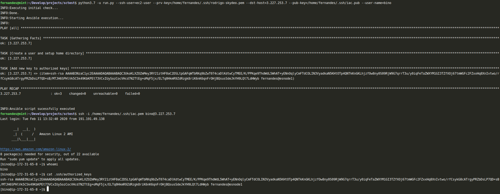

# SC Project

This project is responsible to execute a script, configure a user home and add a ssh key into his **_authorized_keys_** file.

Ansible is the configuration management tool chose for this project.

Python is the language used as scripting tool to run the project.

## Requirements

The project was made to run on a Linux O.S.

* Python3.7 - https://www.python.org/downloads/
* Ansible 2.5 - https://docs.ansible.com/ansible/latest/installation_guide/intro_installation.html

Check you O.S. version for installation instructions.

## Variables

There are 5 variables which this project depends on. If one is missing, the project will fail.
This variables must be passed as python arguments. 


**_ANSIBLE VARIABLES:_**

* **SSH_USER**: Ansible will connect to the remote instance through this user.
* **PRV_KEY**: The private ssh key file already configured to have remote access (authorized_keys).
* **DST_HOST**: The IP or HOSTNAME of the destination host to be configured.

_**SETUP VARIABLES**_
* **USER_NAME**: The user name for the new user to be created.
* **PUB_KEY**: The ssh public key to be authorized for the new user. 


```
root@fernandes: python3.7 run.py -h
usage: run.py [-h] [--ssh-user SSH_USER] [--prv-key PRV_KEY]
              [--dst-host DST_HOST] [--pub-key PUB_KEY]
              [--user-name USER_NAME]

Execute Ansible script to create and setup ssh authorization

optional arguments:
  -h, --help            show this help message and exit
  --ssh-user SSH_USER   the username used by Ansible to connect on destination
                        instance
  --prv-key PRV_KEY     a private key file already authorized to connect on
                        destination
  --dst-host DST_HOST   the destination hostname or ip address
  --pub-key PUB_KEY     the public key file to be added as authorized_key
  --user-name USER_NAME
                        the username to be created
```


## Execution example
 
 